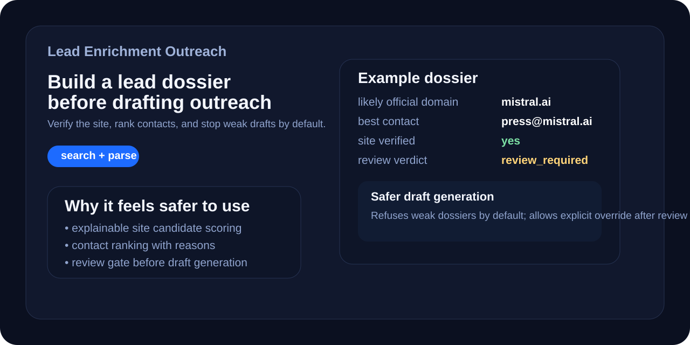

# Lead Enrichment Outreach



Turn a company name into a reviewable outreach dossier — and only draft outreach when the evidence is good enough.

A lightweight Python toolkit first, with an optional OpenClaw skill for the same workflow.

## Why this is useful

A lot of lead-enrichment demos look impressive right until they pick the wrong site, surface `press@`, and confidently generate a bad email.

This repo is opinionated in the other direction:

- prefer reviewable output over black-box confidence
- show *why* a site or contact was chosen
- warn when the dossier is too weak
- refuse draft generation by default when trust is low

## What you get

- company → dossier JSON
- site verification score + candidate list
- contact ranking with reasons and source attribution
- review verdict: `ready`, `review_required`, or `blocked`
- safer outreach drafting with a fail-closed default
- an operator-review layer for editing drafts before send

## 10-second example

```bash
python3 skill/scripts/enrich_lead.py --company "DeepL" > dossier.json
python3 skill/scripts/generate_outreach.py dossier.json \
  --offer "AI-assisted lead enrichment and outreach"
```

If the dossier is weak, the second command stops instead of bluffing.

## Quick start

```bash
git clone https://github.com/Chnurok/lead-enrichment-outreach.git
cd lead-enrichment-outreach
python3 -m venv .venv
source .venv/bin/activate
pip install -r requirements.txt
python3 -m unittest discover -s tests -q
```

## Golden path

1. Start with a company name and, when available, a domain.
2. Generate one dossier.
3. Check `review.status` before doing anything else.
4. Inspect sources, warnings, and top contact candidates.
5. Draft outreach only when the dossier is `ready`, or consciously override after manual review.

## Output shape that matters

The enrichment output includes trust-oriented fields such as:

- `site_verification`
- `site_candidates`
- `best_contact_email`
- `best_contact_source`
- `email_sources`
- `phone_sources`
- `trust_signals`
- `review`
- `warnings`

Example review block:

```json
{
  "review": {
    "status": "review_required",
    "ready_for_outreach": false,
    "reasons": [
      "Best available contact looks weak for outreach",
      "Dossier needs human review before outreach"
    ],
    "next_step": "review sources and edit the dossier before using any outreach draft"
  }
}
```

## Examples worth opening

- `examples/openai-dossier.json` — credible dossier with a deliberate weak-contact warning
- `examples/demo-output.json` — side-by-side `review_required` and `ready` examples
- `examples/deepl-draft.json` — draft from a dossier that passed the trust gate
- `examples/openai-draft.json` — illustrative override case for a weak but official contact

## Safer drafting behavior

Default behavior:

```bash
python3 skill/scripts/generate_outreach.py openai-dossier.json \
  --offer "AI-assisted lead enrichment and outreach"
```

Expected result: non-zero exit with a refusal message, because the dossier is not ready.

Override only after manual review:

```bash
python3 skill/scripts/generate_outreach.py openai-dossier.json \
  --offer "AI-assisted lead enrichment and outreach" \
  --allow-review-required
```

## Repo layout

- `skill/` — installable OpenClaw skill
- `skill/scripts/` — enrichment, batch processing, and draft-generation scripts
- `tests/` — unit tests around ranking, summaries, trust, and draft gating
- `examples/` — curated public examples
- `ui/` — operator review surface for human approval before send *(planned consolidation target)*

## Product direction

This repository is the main product now.

The previously separate **B2B Outreach Editor** is being folded into this workflow as the human-review layer rather than kept as a standalone product story.

Target flow:

1. find / verify company
2. build dossier
3. rank contacts
4. generate draft only when trust is good enough
5. let an operator review/edit/approve before send

## Reliability notes

This repo uses public web results and intentionally lightweight heuristics. Expect some failure modes:

- sites that block fetching
- noisy phones or emails from raw HTML
- directory pages outranking the likely official site
- weak but official contacts such as `press@` or `privacy@`
- summaries that still need human cleanup

If the dossier looks wrong, treat it as wrong.

## OpenClaw packaging

```bash
python3 /usr/lib/node_modules/openclaw/skills/skill-creator/scripts/package_skill.py skill dist
```

`dist/` is generated during packaging and is not meant to stay committed.

## Release notes

See `CHANGELOG.md` for the latest upgrade notes.

## License

MIT
